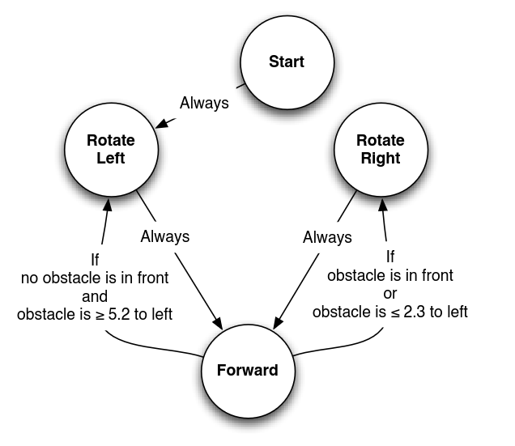

## Included packages

* `ros_gz_description` - holds the sdf description of the simulated system and any other assets.

* `ros_gz_gazebo` - holds gazebo specific code and configurations.

* `ros_gz_app` - holds ros2 specific code and configurations.

* `ros_gz_bringup` - holds launch files and high level utilities.


## Usage

1. Build the project

    ```bash
    colcon build --cmake-args -DBUILD_TESTING=ON
    ```

1. Source the workspace

    ```bash
    source ./install/setup.sh
    ```

1. Launch the simulation

    ```bash
    ros2 launch ros_gz_bringup diff_drive.launch.py
    ```

For a more detailed guide on using this package see [the Gazebo documentation](https://gazebosim.org/docs/latest/ros_gz_project_template_guide).

## Assignment

1. Launch the simulation. You should see a two-wheeled robot in a maze-type
   environment. Two windows launch:  the Gazebo simulation of a differential drive robot
   in a maze and RViz, a ROS program that visualizes topics such as pose and odometry estimates and sensor readings.
   - **Note:** Each time you launch the simulation, to you need to press the arrow-shaped "Play" button in the lower left hand corner of the Gazebo simulator.
   - In a new terminal running ROS2, run the command

   ```bash
   ros2 topic pub /diff_drive/cmd_vel geometry_msgs/msg/Twist "{linear: {x: 5.0, y: 0.0, z: 0.0}, angular: {x: 0.0, y: 0.0, z: -0.1}}"
   ```

   - In another terminal running ROS2, run the command

   ```bash
   ros2 topic echo /diff_drive/scan
   ```

   What do you notice about the output of the second command as the robot moves
   around the simulated space? This topic publishes the current distance measured
   by a single-laser range detector.

2. Using publisher and subscriber nodes, implement a wall-following strategy
that uses the laser scan data to ensure the robot can follow the wall all the
way around the environment. Submit a screenshot of the RViz window with the
odometry path of your robot in your writeup. The figure below shows an example of a high-level
strategy for wall-following. The numbers are arbitrary and you may structure your controller differently.



3. Use CTRL+C to close the simulator and RViz. Open the file `ros_gz_description/models/diff_drive/model.sdf` in a text
editor. Search for the word "sensor" to find the definition of the laser
scanner.

   - **a.** In the `<range>` block, change the max range to be 1.0 instead of 100.0 .
      Save the file, rebuild the entire lab2 ROS package, and restart your simulation.
      What is the effect on your wall-following strategy? How can you change your
      strategy to compensate for the reduced sensing range? Reset your system to have a
      maximum range of 100.0 when you are done.

   - **b.** In the `<noise>` block, change the standard deviation of the sensor noise
      (`stddev`) to be 1.0 instead of 0.1. Save, rebuild, and restart your simulation.
      What is the effect on your wall-following strategy? How can you compensate for
      the large noise level? Reset your system to a noise level of 0.1 when you are done.
   
   - **c.** In the `<noise>` block, change the `mean` to be nonzero. What is the effect
      on your wall-following strategy? What happens as the value of the mean gets
      larger? What happens as the mean gets smaller (the sensor experiences a stronger
      negative bias)?


4. (Graduate students only) Implement a low-pass filter on your rangefinder data in your
wall-following code. Analyze the performance of your wall-following strategy
with respect to both:
   - **a.** Varying the standard deviation of the rangefinder noise; and
   - **b.** Varying the baseline speed of the robot.
Ideally, include a plot each for a) and b), graphing a metric of the performance of your system
over time. Screenshots of RViz are OK too, as well as precise technical descriptions
of the resulting robot motion.
